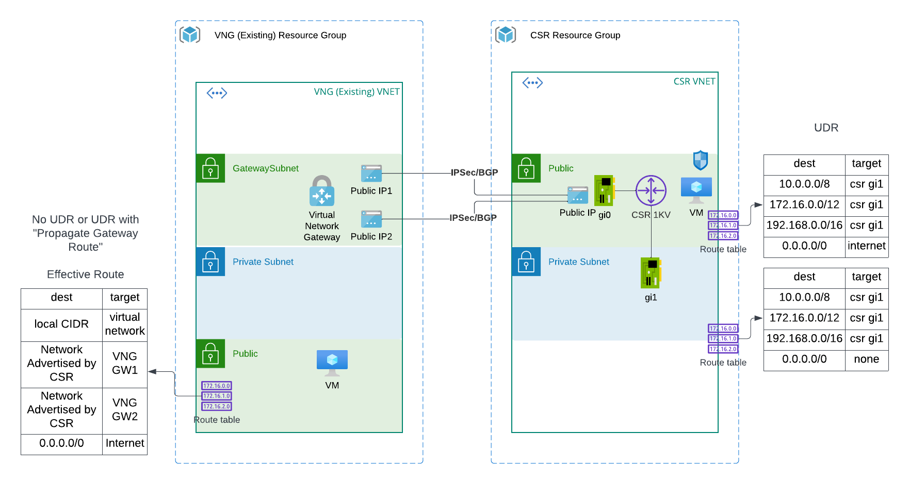

# terraform-azure-vng-to-csr-ipsec-bgp

This module deploys an Azure VNG (Virtual Network Gateway) in existing vNet, as well as Cisco CSR in a new vNet simulate on-premise environment. A test workload will be deployed in the same vNet in the CSR vNet with RFC1918 point to CSR interface.


## Architecture


## Validated environment
```
Terraform v1.3.7
on linux_amd64
+ provider registry.terraform.io/hashicorp/azurerm v3.0.0
+ provider registry.terraform.io/hashicorp/http v3.2.1
+ provider registry.terraform.io/hashicorp/random v3.4.3
```

## Cost estimate
``` 
Name                                                                    Monthly Qty  Unit                      Monthly Cost

 azurerm_linux_virtual_machine.csr
 ├─ Instance usage (pay as you go, Standard_B2ms)                                730  hours                           $60.74
 └─ os_disk
    ├─ Storage (S4)                                                                1  months                           $1.54
    └─ Disk operations                                            Monthly cost depends on usage: $0.0005 per 10k operations

 azurerm_public_ip.csr_pip
 └─ IP address (static)                                                          730  hours                            $3.65

 azurerm_public_ip.vng_pip
 └─ IP address (static)                                                          730  hours                            $3.65

 azurerm_public_ip.vng_pip_ha
 └─ IP address (static)                                                          730  hours                            $3.65

 azurerm_virtual_network_gateway.vng
 ├─ VPN gateway (VpnGw2AZ)                                                       730  hours                          $411.72
 ├─ VPN gateway P2S tunnels (over 128)                            Monthly cost depends on usage: $7.30 per tunnel
 └─ VPN gateway data tranfer                                      Monthly cost depends on usage: $0.035 per GB

 azurerm_virtual_network_gateway_connection.to_csr
 └─ VPN gateway (VpnGw2AZ)                                                       730  hours                           $10.95

 module.azure-linux-vm-public.azurerm_linux_virtual_machine.this
 ├─ Instance usage (pay as you go, Standard_B1s)                                 730  hours                            $7.59
 └─ os_disk
    ├─ Storage (S4)                                                                1  months                           $1.54
    └─ Disk operations                                            Monthly cost depends on usage: $0.0005 per 10k operations  

 module.azure-linux-vm-public.azurerm_public_ip.this
 └─ IP address (static)                                                          730  hours                            $0.00

 OVERALL TOTAL                                                                                                       $505.02
──────────────────────────────────
25 cloud resources were detected:
∙ 8 were estimated, 3 of which include usage-based costs, see https://infracost.io/usage-file
∙ 13 were free, rerun with --show-skipped to see details
∙ 4 are not supported yet, rerun with --show-skipped to see details
```
## Reference

https://microsoft.github.io/WhatTheHack/035-HubAndSpoke/Student/Resources/csr.html
